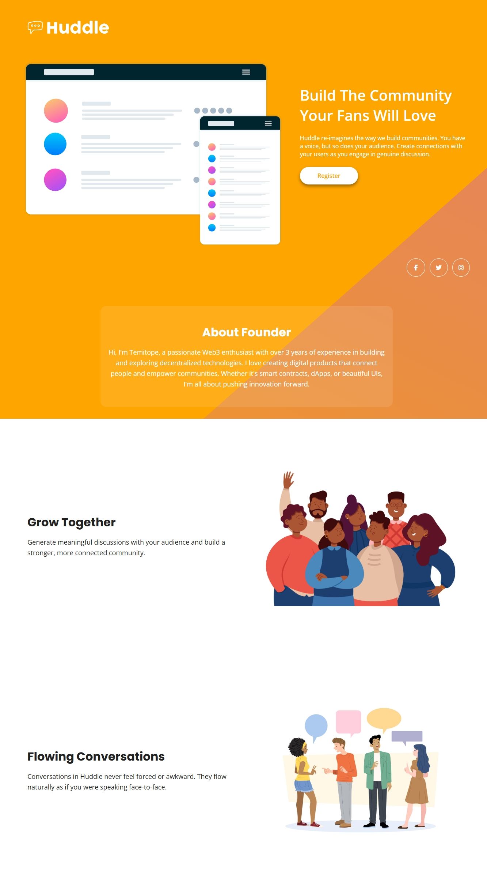

Huddle Landing Page

This is my solution to the [Huddle landing page with a single introductory section challenge](https://www.frontendmentor.io/challenges/huddle-landing-page-with-a-single-introductory-section-B_2Wvxgi0) on Frontend Mentor. It helped me apply responsive layout skills and focus on visual hierarchy and structure.

---

## Table of Contents

- [Overview](#overview)
  - [The Challenge](#the-challenge)
  - [Screenshot](#screenshot)
  - [Links](#links)
- [My Process](#my-process)
  - [Built With](#built-with)
  - [What I Learned](#what-i-learned)
  - [Continued Development](#continued-development)
  - [Useful Resources](#useful-resources)
- [Author](#author)
- [Acknowledgments](#acknowledgments)

---

## Overview

### The Challenge

Users should be able to:

- View the optimal layout for their device’s screen size
- Experience hover effects on all interactive elements
- Understand the product's purpose from visual hierarchy

### Screenshot



---

### Links

- **Solution URL:** [https://github.com/ismailtemitope05/huddle.landing.page](https://github.com/ismailtemitope05/huddle.landing.page)
.- **Live Site URL:** [https://ismailtemitope05.github.io/huddle.landing.page](https://ismailtemitope05.github.io/huddle.landing.page)

---

## My Process

### Built With

- Semantic **HTML5**
- **CSS3** custom properties
- **Flexbox** & **CSS Grid**
- Mobile-first workflow


### What I Learned

I deepened my understanding of layout flexibility, mobile-first design, and overlap effects with CSS.

```css
.cta-overlap {
  background-color: var(--clr-white);
  color: var(--clr-Violet);
  text-align: center;
  padding: 2rem;
  border-radius: 1rem;
  margin: -5rem auto 3rem;
}
````

### Continued Development

I'm planning to:

* Improve accessibility and add dark mode support

### Useful Resources

* [Frontend Mentor](https://www.frontendmentor.io)
* [CSS Tricks - A Guide to Flexbox](https://css-tricks.com/snippets/css/a-guide-to-flexbox/)
* [Kevin Powell on YouTube](https://www.youtube.com/kepowob)
* [KimDoesCode] (https://youtu.be/O4sZf9wG_RE?si=_DJp0Rr6Gx0z-2oh)

---

## Author

* GitHub: [@ismailtemitope05](https://github.com/ismailtemitope05)
* Twitter (X): [@Topeearn](https://x.com/Topeearn)

---

## Acknowledgments

Thanks to the Frontend Mentor community for their continuous inspiration. Also grateful for creators like **Kevin Powell** and **KimDoesCode** for sharing educational content that helped polish this project.

